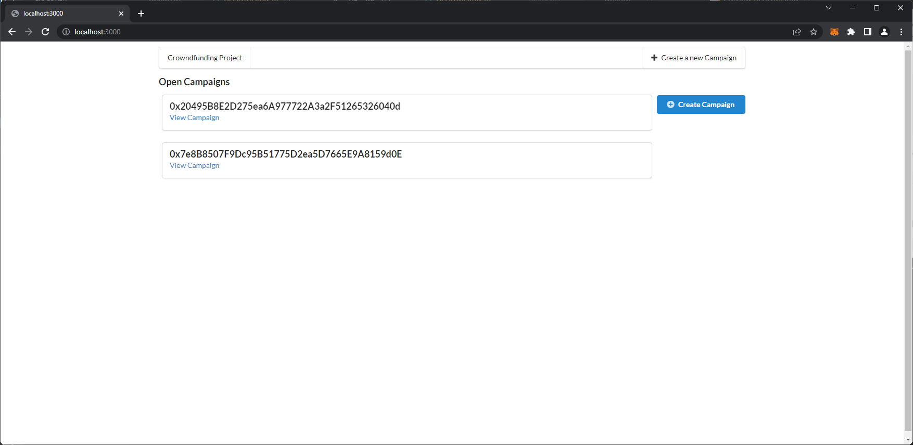
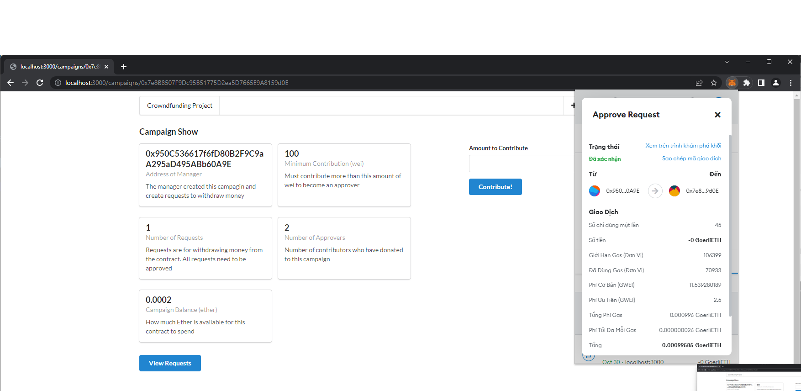
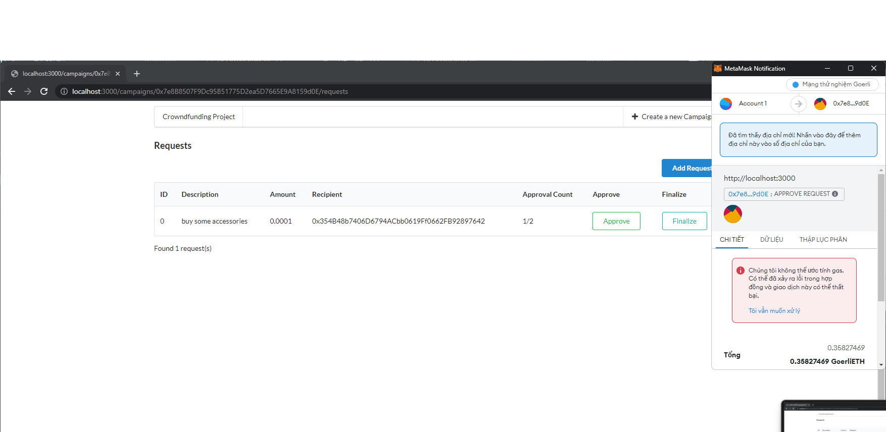

# BLOCKCHAIN VÀ ỨNG DỤNG
## CROWDFUNDING WEBSITE

# MEMBER OF GROUP 9
| MSSV       | HỌ VÀ TÊN     |
| ---------- | ------------- |
| 4501104129 | Lý Hoàng Long |
| ---        | Thanh Trâm    |
| ---        | Đức Huy       |

# INTRODUCING
> Chủ đề này là xây dựng một nền tảng tài trợ đám đông tin cậy (crowdfunding application) bằng hợp đồng thông minh(smart contract)
> Đây là một nền tảng dựa trên công nghệ Blockchain và Smart Contract, cùng với những công nghệ trên, nền tảng này có thể giúp cho các nhà đầu tư có thể biết được số tiền đang đi đến đâu, cách dự án chi tiêu cũng như chặn dòng tiền đầu tư từ dự án vào mục đích sai trái
> Cụ thể là trong chủ đề này, chúng ta sẽ cài đặt hợp đồng(contract) để kiểm soát người dùng tạo các campaign gửi tiền đến đầu. Người đóng góp không gửi tiền trực tiếp cho người tạo ra campaign đó mà thông qua Ethereum Contract. 
>Manager (người tạo campaign) sẽ tạo
một “spending request” trong contract để rút tiền từ contract gửi đến địa chỉ
chính đáng giúp phát triển dự án (như địa chỉ bán linh kiện, cung cấp pin,
…). Sau đó, tất cả các người tham gia đóng góp sẽ vote các spending
request này. Nếu có trên 50% số người đóng góp đồng ý, manager mới có
thể gửi tiền từ request đó đến các địa chỉ chính đáng (các nhà cung cấp,…).
Nếu đây là một request tệ, lừa đảo, nhiều người không đồng ý thì manager
không thể gửi tiền đi.
Bằng cách sử dụng blockchain và Ethereum smart contract, ít nhất các
người đóng góp sẽ biết tiền được gửi đi đâu và có khả năng xem xét vote
các spending request trước khi tiền từ dự án được tiêu. Dự án này cung cấp
quyền theo dõi và quản lý dự án cho nhà đầu tư, giảm thiểu rủi ro trong các
nền tảng tài trợ đám đông hiện nay.

# SCREENSHOT DEMO
# INGREDIENTS
* *ReactJS*
* *Solidity*
* *Ethereum Smart Contract*
# BUILDING RECIPES
### Cài đặt GIT
Vào trang chủ [Git](https://git-scm.com/) và cài đặt
### Cài đặt Node và NPM
Vào trang chủ [Node](http://~) và cài đặt
## Clone Repository
`https://github.com/longhoangcoder/crowdfunding_blockchain.git`
## Cài đặt các Dependencies
`npm install`
- trong trường hợp không cài được thì thêm --force đằng sau chữ install

## Chạy website
1. Tại folder crowdfunding_blockchain, nhập vào terminal `cd ethereum`, sau đó chạy file `compile.js` bằng cách nhập `node compile.js`
>Compile.js để compile các contract và
lưu vào thư mục build trong folder Ethereum (gồm các chức năng chính cho mỗi lần compile mới như delete file build nếu đã có từ trước, đọc file Campaign.sol, compile các contract bằng solidity complie trong file Campaign.sol và viết các output vào folder build).
2. Sau khi file build đã tạo thành công tại thư mục ethereum, cũng tại thư mục đó, ta chạy file `deploy.js`
>File deploy.js để deploy CampaignFactory.json đã được compile (update compiledFactory.interface từ một account address). Sau đó deploy contract lên Goerli testnet (read CampaignFactory.json từ local)
**Lưu ý:** Ở đây nhóm em sử dụng Goerli ETH để demo. Ở hàm provider, ta phải insert mã mnemonic ví Meta của mình và Endpoint link (có thể lấy từ trang web [Infura](https://docs.infura.io/infura/getting-started))
3. Sau khi deploy thành công thì ta sẽ có một cái địa chỉ contract, dán địa chỉ đó vào trong file `factory.js` như thế này:
```js
const instance = new web3.eth.Contract(
   CampaignFactory.abi,
    //contract address
)
``` 
4. Tại `web3.js` ta paste link endpoint (line 13)
```js
  const provider = new Web3.providers.HttpProvider(
    '//endpoint link'
  );
```
5. Trở về lại thư mục gốc, gõ `npm run start` hoặc `node server.js`

